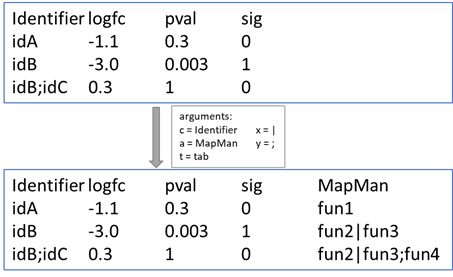
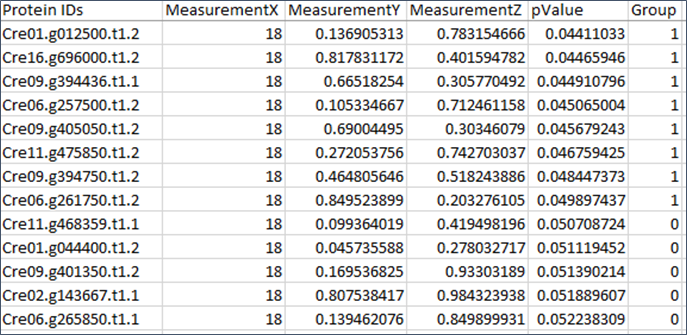
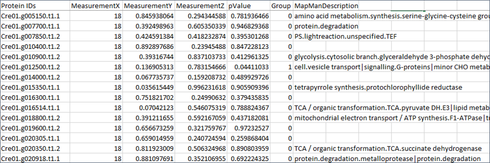
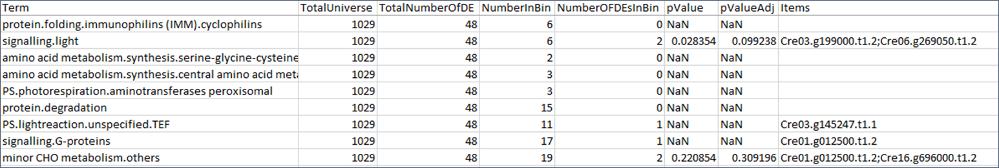
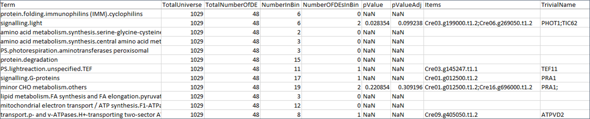

[](https://doi.org/10.5281/zenodo.6340412)

**Cite as**

Benedikt Venn & Timo Mühlhaus (2022), CSBiology/OntologyEnrichment: Release 0.0.1 (0.0.1). Zenodo. https://doi.org/10.5281/zenodo.6340412


# OntologyEnrichment

With this command line tool you can annotate _Cre_ or _AT_ identifier originating from _Chlamydomonas reinhardtii_ (genome release jgi 5.5) and 
_Arabidopsis thaliana_ (Araport 11) and perform enrichment studies.
The annotation is based on the Functional Annotator Tool (FATool). Enrichment is facilitated using BioFSharp (version 2.0.0-preview.2) and FSharp.Stats (version 0.4.4).
For each identifier you can query the information of the following ontologies:
  - MapMan
  - Gene Ontology (GO)
  - Trivial name
  - Localization

After data annotation you can perform an gene set enrichment analysis (GSEA) to inspect which functional groups or other properties are overrepresented in your data.

## Usage

### Prerequisite 
  - .NET SDK >= 6.0.0

Download and extract the OntologyEnrichment archive from the [latest release](https://github.com/CSBiology/OntologyEnrichment/releases). With a shell of your choice navigate to the OntologyEnrichment directory and either call `OntologyEnrichment.exe annotate <options>` or `OntologyEnrichment.exe enrich <options>`.


## Annotation

The columns in your raw data should not be separated by comma (.csv) since MapMan descriptions may contain commas.
You can define how multiple identifier are separated and how multiple annotations should be separated in the result file.
If you wan to annotate multiple ontologies use multiple `-a` arguments. 

The arguments of the annotation script are:

```
OPTIONS:

    --inputpath, -i <path>
                          input file path
    --outputpath, -o <path>
                          output file path
    --columnheader, -c <string>
                          columnheader of identifier column in annotation table
    --columnseparator, -t <string>
                          column separator (tab , ; ...)
    --species, -s <arabidopsis|chlamydomonas>
                          Organism
    --annotation, -a <mapman|mapmandes|go|godes|trivialname|localization>
                          annotation
    --annotationseparator, -x <string>
                          multiple annotation separator
    --identifierseparator, -y <string>
                          multiple identifier separator
    --help                display this list of options.
```



_Note: Cre identifier are automatically truncated before annotation (Cre01.g000250.t1.2 -> Cre01.g000250)_

## Enrichment

Enrichments are used to analyse overrepresented properties statistically. Further information can be found [here](https://csbiology.github.io/BioFSharp//GSEA.html)
  - For ontology enrichment a data column is necessary, that indicates a significance of each row. This indication must be an integer (e.g. 0 for non-significant, and 1 for significant). It is also possible to define several groups (-1 for sig. down regulation, 0 for non-significant, 1 for sig. up regulation)
  - MapMan Annotations show a tree structure. There are ~35 root terms that split up to a level depth of 7. Based on the study design it makes sense to expand the ontology term (e.g. 29.5.3.2 becomes 29.5.3.2, 29.5.3, 29.5, and 29)
  - splitPVal threshold is set to 5
  - The minimum count of elements is set to 2. If none or just one item within the respective bin is called significant, the corresponding p value will be NaN.
  - The pValue is corrected for multiple testing by Benjamini Hochberg

```
OPTIONS:

    --inputpath, -i <path>
                          input file path
    --outputpath, -o <path>
                          output file path
    --columnseparator, -t <string>
                          column separator (tab , ; ...)
    --idcolumnheader, -c <colHeader>
                          columnheader of identifier column in table
    --annotationcolumnheader, -a <colHeader>
                          columnheader of annotation column in table
    --significancecolumnheader, -s <colHeader>
                          columnheader of significance column in table
    --significancecriterion, -p <group>
                          group index of positive group (significant items)
    --annotationseparator, -z <string>
                          multiple annotation separator
    --expandontologytree, -e <bool>
                          defines if annotation terms are expanded (25.4.3 -> 25; 25.4; 25.4.3)
    --help                display this list of options.
```

## Examples

#### 1. raw data frame



#### 2. Annotation of raw data

  `OntologyEnrichment.exe annotate -i "C:\Users\bvenn\chlamydomonas.txt" -o "C:\Users\bvenn\chlamydomonas_mm.tsv" -c "Protein IDs" -t tab -s Chlamydomonas -a MapManDes`
   
  

#### 3. Enrichment of annotated data

  `OntologyEnrichment.exe enrich -i "C:\Users\bvenn\chlamydomonas_mm.tsv" -o "C:\Users\bvenn\chlamydomonas_enriched.tsv" -c "Protein IDs" -t tab -a "MapManDescription" -s Group -p 1 -z ";" -z "|" -e true`
  
  

#### 4. Annotation of enrichment table with trivial names

  `OntologyEnrichment.exe annotate -i "C:\Users\bvenn\chlamydomonas_enriched.tsv" -o "C:\Users\bvenn\chlamydomonas_enriched_trivial.tsv" -c "Items" -t tab -s Chlamydomonas -a trivialname`
  
  

## References

  - Kevin Schneider, Lukas Weil, David Zimmer, Benedikt Venn, & Timo Mühlhaus. (2022). CSBiology/BioFSharp. Zenodo. https://doi.org/10.5281/zenodo.6335372
  - Benedikt Venn, Lukas Weil, Kevin Schneider, David Zimmer, & Timo Mühlhaus. (2022). fslaborg/FSharp.Stats. Zenodo. https://doi.org/10.5281/zenodo.6337056 
  - Usadel B, Poree F, Nagel A, Lohse M, Czedik-Eysenberg A, Stitt M (2009) A guide to using MapMan to visualize and compare Omics data in plants: a case study in the crop species, Maize. Plant Cell Environment, 32: 1211-1229
  - Thimm O, Blaesing O, Gibon Y, Nagel A, Meyer S, Krüger P, Selbig J, Müller LA, Rhee SY and M Stitt (2004) MAPMAN: a user-driven tool to display genomics data sets onto diagrams of metabolic pathways and other biological processes. Plant J. 37(6):914-39.  
  - Ashburner et al. Gene ontology: tool for the unification of biology. Nat Genet. May 2000;25(1):25-9
  - The Gene Ontology resource: enriching a GOld mine. Nucleic Acids Res. Jan 2021;49(D1):D325-D334.
  - FATool

